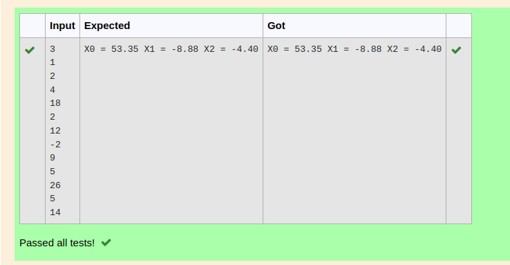

# Gaussian Elimination

## AIM:
To write a program to find the solution of a matrix using Gaussian Elimination.

## Equipments Required:
1. Hardware – PCs
2. Anaconda – Python 3.7 Installation / Moodle-Code Runner

## Algorithm
1. At first, we have imported the necessary libraries we will use in our program.
2. Read Number of Unknowns: n
3. Read Augmented Matrix (A) of n by n+
4. Transform Augmented Matrix (A) 
   to Upper Trainagular Matrix by Row Operations.

5. After that, we applied the Gaussian elimination method.
6. After that, we apply the back substitution method to obtain the desired output.
7. Display Result.

## Program:
## Program to find the solution of a matrix using Gaussian Elimination.
## Developed by: s.vinod kumar
## RegisterNumber: 22004903


``` python
import numpy as np
import sys 

n=int(input()) #input
a=np.zeros((n,n+1))
#print(a)
x=np.zeros(n)
#to get the A matrix
for i in range(n):
    for j in range(n+1):
        a[i][j]=float(input())
    #print(a)
         
#apply gaussian elimination
for i in range(n):
    if a[i][j]==0.0:
        sys.exit('Divide by zero found')
        
    for j in range(i+1,n):
        ratio=a[j][i]/a[i][i]
        
        for k in range(n+1):
            a[j][k]=a[j][k]-ratio*a[i][k]
        
#back substitution
x[n-1]=a[n-1][n]/a[n-1][n-1] 

for i in range(n-2,-1,-1):
    x[i]=a[i][n]

    for j in range(i+1,n):
        x[i]=x[i]-a[i][j]*x[j]
        
    x[i]=x[i]/a[i][i]
    
#display soln
for i in range(n):
    print('X%d = %0.2f'%(i,x[i]),end=' ')

```

## Output:



## Result:
Thus the program to find the solution of a matrix using Gaussian Elimination is written and verified using python programming.

